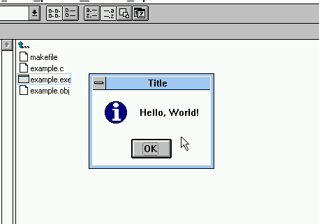

# very simple WIN32 example
This very simple program that displays a "Hello, world!" message box.



## Compiling the program
This program is to verify the compiler setup and not to have a useful win32 application...

### DOS with Open Watcom 2.0
#### Using Watcom Compile and Link 386 utility (wcl386)
The compile and make utility will compile and link the program for you.
It is a quick way to compile and link a program without diving too deep into the
specifics of the compiler and especially the linker.

```
C:\EXAMPLE>set include=%watcom%\h;%watcom%\h\nt

C:\EXAMPLE>wcl386 /l=nt_win /bt=nt example.c
Open Watcom C/C++ x86 32-bit Compile and Link Utility
Version 2.0 beta Feb  1 2024 23:57:59 (16-bit)
Copyright (c) 2002-2024 The Open Watcom Contributors. All Rights Reserved.
Portions Copyright (c) 1988-2002 Sybase, Inc. All Rights Reserved.
Source code is available under the Sybase Open Watcom Public License.
See https://github.com/open-watcom/open-watcom-v2#readme for details.
	wcc386 EXAMPLE.C  -bt=nt
Open Watcom C x86 32-bit Optimizing Compiler
Version 2.0 beta Feb  1 2024 23:53:01 (32-bit)
Copyright (c) 2002-2024 The Open Watcom Contributors. All Rights Reserved.
Portions Copyright (c) 1984-2002 Sybase, Inc. All Rights Reserved.
Source code is available under the Sybase Open Watcom Public License.
See https://github.com/open-watcom/open-watcom-v2#readme for details.
EXAMPLE.C: 12 lines, included 102492, 0 warnings, 0 errors
	wlink @__wcl_00.lnk
Open Watcom Linker Version 2.0 beta Feb  1 2024 23:50:32 (32-bit)
Copyright (c) 2002-2024 The Open Watcom Contributors. All Rights Reserved.
Portions Copyright (c) 1985-2002 Sybase, Inc. All Rights Reserved.
Source code is available under the Sybase Open Watcom Public License.
See https://github.com/open-watcom/open-watcom-v2#readme for details.
loading object files
searching libraries
creating a Windows NT windowed executable
```

The command line is `wcl386 /l=nt_win /bt=nt example.c`:
| Command part | Description                                                         |
| ------------ | ------------------------------------------------------------------- |
| `wcl386`     | Watcom compile and link utility for 386 (to create 32-Bit programs) |
| `/l=nt_win`  | Linker: Create a NT executable for the windowed environment         |
| `/bt=nt`     | C/C++ compiler: generate code for Windows NT                        |

#### Using Watcom Make and the Makefile (wmake + Makefile)

```
C:\EXAMPLE>set include=%watcom%\h;%watcom%\h\nt

C:\EXAMPLE>wmake clean all
Open Watcom Make Version 2.0 beta Feb  1 2024 23:50:46 (32-bit)
Copyright (c) 2002-2024 The Open Watcom Contributors. All Rights Reserved.
Portions Copyright (c) 1988-2002 Sybase, Inc. All Rights Reserved.
Source code is available under the Sybase Open Watcom Public License.
See https://github.com/open-watcom/open-watcom-v2#readme for details.
	del example.obj
	del example.exe
	wcc386 -bt=nt -zq example.c -fo=example.obj
	wlink op q SYS nt_win runtime win=3.10 F { example.obj } N example.exe
```

##### Compiler commands
| Compiler command | Description                                      |
| ---------------- | ------------------------------------------------ |
| -bt=nt           | Generate code for Windows NT                     |
| -zq              | Quiet operation (do not print program banners)   |
| -fo=$@           | Output file name: Target name (e.g. example.obj) |
| $<               | Input file name: Source file (e.g. example.c)    |

##### Linker commands
| Linker command   | Description                                                                                            |
| ---------------- | ------------------------------------------------------------------------------------------------------ |
| op q             | **OP**tion **Q**uiet: Do not print program banners                                                     |
| SYS nt_win       | **SYS**tem **nt_win**: Use "**nt_win**" system definition. (See wlsystem.lnk or wlink.lnk)             |
| runtime win=3.10 | Set "Subsystem version" in PE header to **3.10**. (Not required for win32s?)                           |
| F { $< }         | **F**iles { $< }: Files to link together. **$<** Specified dependencies in Make file. e.g. example.obj |
| N $@             | **N**ame: Output file name. **$@**: Use make target name. e.g. example.exe                             |
